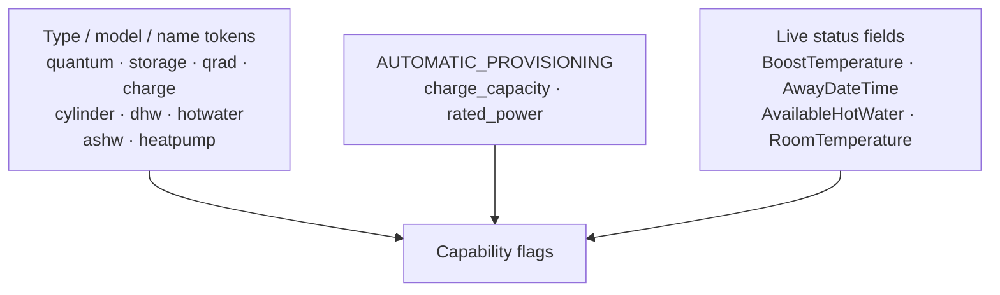

# Appliance support

This page says plainly what is **verified** against real hardware, what is **inferred** from
reading the official app, and what is **untested**. The underlying library does the same in
its [decompiled API reference](https://github.com/KRoperUK/dimplex-controller-py/blob/main/docs/decompiled-api-reference.md),
and it matters here for the same reason: an untested feature that looks supported wastes
somebody's evening.

The integration is developed against the hardware its authors and reporters own. Nobody has
access to the full Dimplex range.

## By family

| Family                                        | Status                                  | Notes                                                                                                        |
| --------------------------------------------- | --------------------------------------- | ------------------------------------------------------------------------------------------------------------ |
| Panel heaters, PLX, other simple room heaters | **Verified**{ .status-verified }        | Exercised routinely. Climate, presets, setpoint writes and modes all confirmed.                              |
| QRAD                                          | **Verified**{ .status-verified }        | As above, plus energy telemetry.                                                                             |
| Quantum storage heaters                       | **Partly verified**{ .status-inferred } | Modes and energy confirmed. Setpoint and timer writes are **rejected on some units** — see below.            |
| Hot water cylinders                           | **Untested**{ .status-untested }        | Endpoints exist in the library, confirmed from the app, never run against hardware. No entities are created. |
| Air-source heat pumps (ASHW)                  | **Untested**{ .status-untested }        | Detected by the capability matrix; no dedicated support.                                                     |
| Hygiene / anti-legionella cycles              | **Untested**{ .status-untested }        | Mode bit is read but never written; no entity.                                                               |

If you own something in the untested rows and are willing to try it,
[say so on an issue](https://github.com/KRoperUK/dimplex-controller-hass/issues) — a
[diagnostics download](../help/diagnostics.md) alone is genuinely useful.

## Quantum and other storage heaters

Charge-based heaters store heat overnight at the cheap rate and release it during the day.
Two consequences that repeatedly confuse people:

**A target does nothing until there is stored charge.** Set 22 °C at midday on a heater that
has exhausted its charge and nothing observable happens — not because the write failed, but
because there is no heat to release. Two of the tests in
[#163](https://github.com/kroperuk/dimplex-controller-hass/issues/163) came back inconclusive
for exactly this reason.

**Some units reject remote writes.** `SetApplianceSetpointTemperature` and `SetTimerMode` can
come back **HTTP 403**. The integration handles this:

- Setpoint writes fall back to the older schedule-rewrite path, so you keep the capability.
- If that is refused too, you get a readable error naming the appliance rather than a generic
  "unknown error" — this was
  [#149](https://github.com/kroperuk/dimplex-controller-hass/issues/149).

When comparing behaviour, compare against the **official app at the same moment**, not
against what a panel heater would do.

## Hot water cylinders

The library implements the hot water surface — read state, set target, schedules, hygiene —
and every endpoint is confirmed from the official app. **None of it has been run against
hardware**, so:

- No hot water entities are created by this integration.
- The capability matrix marks cylinder-only appliances as `climate: false`, so they get no
  thermostat and no advance (there is no "next comfort period" to jump to).
- Library callers can reach the endpoints directly and are warned in every docstring.

## How capabilities are decided

There is no product database. The matrix guesses from three sources, in increasing
specificity:

- `charge_capacity > 0`, or a storage-ish token → **storage**
- `rated_power > 0`, or a storage-ish token → **energy meter**
- a cylinder token, or `AvailableHotWater` present → **hot water**, and `climate: false`
  unless a room temperature also appears
- an `ashw` / heat-pump token → **heat pump** (and hot water)

Control flags — boost, away, advance, open window, EcoStart, frost, timer, setpoint writes —
**default to enabled**. That is deliberate: the cloud exposes these generically, and guessing
"unsupported" would lock people out of endpoints that work. The cost is that an unsupported
call fails at the cloud rather than being hidden, which is why control errors are surfaced
with a readable message.

Your appliance's resolved flags are in a
[diagnostics download](../help/diagnostics.md) under `capabilities`.

## Confirmed but deliberately not exposed

| Endpoint                                                      | Why not                                                                                            |
| ------------------------------------------------------------- | -------------------------------------------------------------------------------------------------- |
| `SetSetbackTemperature`                                       | **Inferred**{ .status-inferred } from the app, never validated live. Available to library callers. |
| Schedule writes                                               | No Home Assistant UI shape for a weekly heater programme, and the write path is unproven.          |
| `ECO` mode (bit 64)                                           | Behaviour on real hardware unknown. See [modes](../use/modes.md#the-eco-preset-is-not-eco-mode).   |
| `HOLIDAY`, `MANUAL`, `HYGIENE`, `STANDBY` and other mode bits | Read into diagnostics, never written.                                                              |

## Temperature ranges

Only two are confirmed:

| Mode                                    | Range      | Status                                                                |
| --------------------------------------- | ---------- | --------------------------------------------------------------------- |
| Away                                    | 7–18 °C    | **Verified**{ .status-verified } — live, and matches the app's picker |
| Frost protection                        | fixed 7 °C | **Verified**{ .status-verified }                                      |
| Normal setpoint, boost, advance, manual | 7–30 °C    | **Inferred**{ .status-inferred } from the app                         |

Away turning out to be an exception means the 7–30 figures should not be fully trusted.
[dimplex-controller-py#98](https://github.com/KRoperUK/dimplex-controller-py/issues/98) tracks
re-reading each mode's range.

## Next

- [Modes & presets](../use/modes.md) — what each mode does
- [Diagnostics](../help/diagnostics.md) — see your own appliance's resolved capabilities
- [Troubleshooting](../help/troubleshooting.md)
