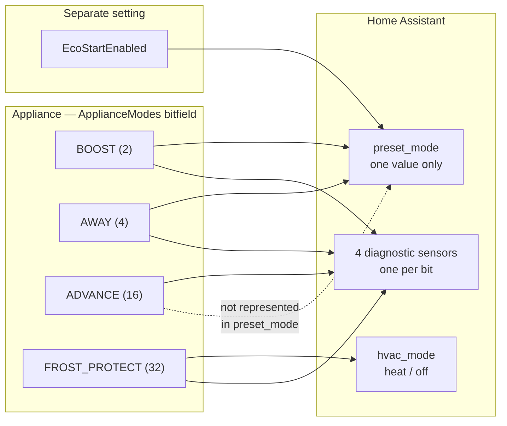

# Modes & presets

Almost everything confusing about this integration follows from one fact:

!!! abstract "The appliance holds a _set_ of modes, not one mode"

    `ApplianceModes` is a **bitfield**. Boost, away, advance, frost protection and several
    others are independent bits, and more than one can be set at the same time. Home
    Assistant's `preset_mode` is a single string, so it can only ever show **one** of them.

That mismatch is why [#163](https://github.com/kroperuk/dimplex-controller-hass/issues/163)
needed a decompiler to diagnose: the integration asked for boost, the appliance engaged
advance, and the dashboard had no way to say so.

## What the appliance reports

The full bitfield, as recovered from the official app. The integration reads four of these
and ignores the rest.

| Bit | Value  | Mode                                                 | Used by the integration                                        |
| --- | ------ | ---------------------------------------------------- | -------------------------------------------------------------- |
| 0   | 1      | `TIMER_MODE` — following the schedule                | Implicitly, as "not overridden"                                |
| 1   | **2**  | **`BOOST`**                                          | :material-check: Boost active sensor, `boost` preset           |
| 2   | **4**  | **`AWAY`**                                           | :material-check: Away active sensor, `away` preset             |
| 3   | 8      | `HOLIDAY`                                            | No                                                             |
| 4   | **16** | **`ADVANCE`**                                        | :material-check: Advance active sensor, `dimplex.set_advance`  |
| 5   | **32** | **`FROST_PROTECT`**                                  | :material-check: Frost protection sensor, HVAC off             |
| 6   | 64     | `ECO`                                                | **No** — see [eco is not Eco](#the-eco-preset-is-not-eco-mode) |
| 7   | 128    | `MANUAL` — holding one target, ignoring the schedule | No                                                             |
| 8   | 256    | `HYGIENE` — hot water cylinder anti-legionella cycle | No                                                             |
| 9   | 512    | `STANDALONE`                                         | No                                                             |
| 10  | 1024   | `SAFE_MODE`                                          | No                                                             |
| 11  | 2048   | `SHUTDOWN`                                           | No                                                             |
| 12  | 4096   | `COMMS`                                              | No                                                             |
| 13  | 8192   | `NORMAL`                                             | No                                                             |
| 14  | 16384  | `STANDBY`                                            | No                                                             |

!!! danger "Before 4.1.0 these values were wrong"

    Earlier releases assumed boost was bit **16** and away bit **32**. Those are in fact
    `ADVANCE` and `FROST_PROTECT`. Asking for boost engaged advance; asking for away engaged
    frost protection and pinned the heater to 7 °C. Both were corrected in 4.1.0 against
    the values above.

## How it maps into Home Assistant



The four diagnostic sensors are the lossless view. `preset_mode` is the convenient one.

## Why `preset_mode` can disagree with reality

The entity resolves the bitfield to a single preset in a fixed order, and stops at the first
match:

1. Frost protection engaged, or the timer is in a frost/off mode → **no preset**, and
   `hvac_mode` is `off`
2. `BOOST` set → `boost`
3. `AWAY` set → `away`
4. `EcoStartEnabled` → `eco`
5. Otherwise → `comfort`

So an appliance holding **both** boost and away reports `boost`, and one holding advance
reports `comfort` — because advance has no preset of its own. Neither is a bug in the
reporting; there is simply nowhere for the second value to go.

**Automate on the diagnostic sensors, not on `preset_mode`**, whenever you care about a
specific mode:

```yaml
triggers:
  - trigger: state
    entity_id: binary_sensor.living_room_advance_active
    to: "on"
```

## Setting a preset clears the others

Home Assistant treats a preset as a single mutually exclusive state, so selecting one
engages exactly what that preset owns and clears the rest.

| Preset    | Engages                       | Clears                |
| --------- | ----------------------------- | --------------------- |
| `comfort` | nothing — follow the schedule | boost, away, EcoStart |
| `boost`   | boost                         | away, EcoStart        |
| `away`    | away                          | boost, EcoStart       |
| `eco`     | EcoStart                      | boost, away           |

Clearing happens before engaging, so the appliance never briefly holds two conflicting
modes.

Before 4.1.0 each preset only _added_ its own state. Switching from `away` to `eco` enabled
EcoStart but left away engaged, and because the resolution order above puts away ahead of
EcoStart, the entity kept reporting `away` and nothing appeared to happen — that was
[#173](https://github.com/kroperuk/dimplex-controller-hass/issues/173).

Presets are also gated by appliance capability: one your appliance does not support is not
offered in `preset_modes` and is skipped rather than sent blindly.

## Temperature range per mode

The ranges genuinely differ, and only one is exposed as a `climate` limit.

| Mode             | Range          | Notes                                                         |
| ---------------- | -------------- | ------------------------------------------------------------- |
| Normal setpoint  | 7–30 °C        | The `climate` entity's `min_temp` / `max_temp`                |
| Boost            | 7–30 °C        | Believed the same; the app's picker offers it                 |
| **Away**         | **7–18 °C**    | Genuinely lower. Higher values are clamped with a log warning |
| Advance          | 7–30 °C        | Or omit it and use the schedule's own target                  |
| Frost protection | **fixed 7 °C** | Not settable                                                  |

Away is the one that surprises people: 18 is the ceiling in the official app's Away picker
too, and the cloud silently reduces anything higher. See
[#174](https://github.com/kroperuk/dimplex-controller-hass/issues/174).

!!! note "The non-Away ranges are inferred, not confirmed"

    7–30 °C for boost, advance and manual comes from reading the official app, not from
    testing each one. Since Away turned out to be an exception, the others are not fully
    trustworthy either.
    [dimplex-controller-py#98](https://github.com/KRoperUK/dimplex-controller-py/issues/98)
    tracks re-reading each mode's range from the app.

## Which modes stack

- **Frost protection wins over everything.** It is the app's "off", and while it is engaged
  the integration reports `hvac_mode: off` and no preset, whatever else is set.
- **Boost and away can both be set** at the appliance. The integration will not put them
  there — presets clear each other — but a change made in the official app can, and the
  diagnostic sensors will show it.
- **Advance stacks with anything.** It affects the _next_ schedule period, so it coexists
  with whatever is happening now.
- **EcoStart is orthogonal.** It is a separate boolean, not a bit in this field, so it can be
  on alongside any mode.

## Timer modes are a different field

`TimerMode` is a small enum, not part of the bitfield, and it says how the appliance treats
its schedule:

| Value | Mode               | Meaning                                        |
| ----- | ------------------ | ---------------------------------------------- |
| 0     | `USER_TIMER`       | Follow the weekly programme — the normal state |
| 1     | `MANUAL`           | Hold one target, ignore the programme          |
| 2     | `FROST_PROTECTION` | The 7 °C floor                                 |
| 3     | `OFF`              | Off                                            |

The integration exposes this as the diagnostic **Schedule** sensor, and treats modes 2 and 3
as "off" for `hvac_mode`, because that is how the official app presents them for most
heaters. Turning a heater back on restores `USER_TIMER` for appliances an earlier release
left parked in mode 2 or 3.

## "Off" is frost protection

There is no off mode. Turning a Dimplex appliance off, in the official app or here, engages
frost protection at 7 °C — an anti-freeze floor that stops rooms and pipework freezing.

So after `climate.turn_off` the entity reports a **7 °C target**, `hvac_mode: off` and
`hvac_action: off`. That is correct. Full detail in
[why "off" reports 7 °C](temperature.md#why-off-reports-7-c).

## The `eco` preset is not Eco mode

Two different things share the name, and the integration uses only one of them.

|            | `EcoStartEnabled`                                                        | `ECO` (bit 64)         |
| ---------- | ------------------------------------------------------------------------ | ---------------------- |
| What       | A pre-heat **setting**                                                   | An appliance **mode**  |
| Does       | Learns the room's warm-up time and starts early so target is met on time | Unknown — never tested |
| Exposed as | The `eco` preset, the **EcoStart** switch, `dimplex.set_eco_start`       | Nothing                |

The `eco` preset drives **EcoStart**. The cloud's separate Eco _mode_ bit is read but never
written and has no entity, because its behaviour on real hardware has not been established.

This ambiguity is worth knowing about precisely because the new mode sensors sit next to a
preset called `eco` that has nothing to do with the `ECO` bit.

## Seeing the real state

Three ways, in increasing detail:

1. **The four diagnostic binary sensors** — boost, away, frost protection, advance. Disabled
   by default; enable them in the entity registry.
2. **A diagnostics download** — decodes `ApplianceModes` into mode names, so you do not have
   to do the arithmetic. See
   [diagnostics & bug reports](../help/diagnostics.md#active_modes-is-the-useful-bit).
3. **The raw value** — `ApplianceModes` appears in diagnostics as an integer. `8198` is
   `BOOST | AWAY | NORMAL` (2 + 4 + 8192)… which is exactly the sort of sum nobody should
   have to do by hand, hence the decoding above.

## Next

- [Temperature & schedules](temperature.md) — how a setpoint write reaches the appliance
- [Actions](../reference/actions.md) — boost, away and advance with their fields
- [Entities](../reference/entities.md#binary-sensors) — the diagnostic mode sensors
- [Automations](automations.md) — triggering on the real mode
