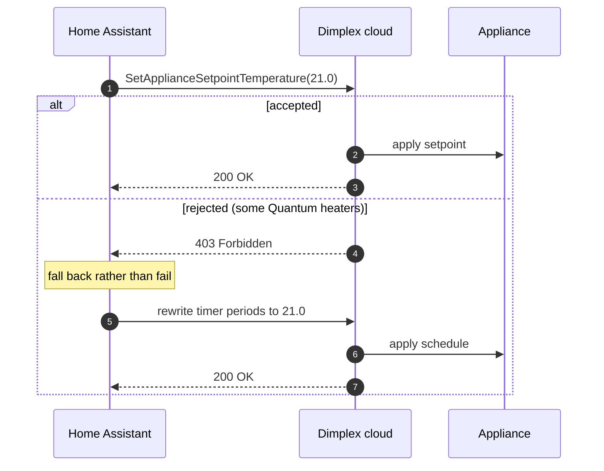

# Temperature & schedules

## Setting a target

`climate.set_temperature` writes through `SetApplianceSetpointTemperature` — the same
endpoint the official app uses. It applies immediately and **does not touch your stored
timer schedule**.

Before 4.1.0 the integration only ever did the second path, which is why Quantum storage
heaters returned HTTP 403 and the write failed outright. The fallback is kept so no
appliance loses the ability to set a target, but on everything that accepts the dedicated
endpoint your schedule now survives a temperature change.

The accepted range comes from the appliance capability matrix, normally **7–30 °C**. Seven
is the frost-protection floor; the cloud's own pickers will not go below it.

## Why "off" reports 7 °C

Dimplex appliances have **no off mode**. What the official app calls "off" is frost
protection: a fixed 7 °C anti-freeze floor that stops pipes and rooms freezing while the
heater is otherwise dormant.

So `climate.turn_off` engages frost protection, and the entity then reports a 7 °C target.
That is correct, not a bug. `climate.turn_on` clears it again.

Turning off also clears boost and away first, so the appliance is not left holding a
conflicting mode. And if an earlier release parked your appliance in the legacy frost/off
_timer_ mode, turning on restores user-timer mode as well.

## Advance vs boost

Both raise the temperature now, but they end differently.

|          | Boost                           | Advance                                           |
| -------- | ------------------------------- | ------------------------------------------------- |
| Duration | Fixed minutes you choose        | Until the next schedule period ends               |
| Target   | A temperature you choose        | The schedule's own target, unless you override it |
| Ends by  | Timer expiring                  | Schedule taking over                              |
| Use for  | "Warm this room up for an hour" | "Start this evening's heating early"              |

Advance is what the official app offers for Quantum and storage heaters, where an arbitrary
boost target is less meaningful than pulling the next charge/heat window forward.

Both are bits in the appliance's mode bitfield, and advance has no Home Assistant preset of
its own — see [Modes & presets](modes.md).

## Editing the weekly schedule

Not supported. The integration reads the schedule and exposes it as a diagnostic
**Schedule** sensor — timer mode plus the day/start/end/temperature periods as attributes —
but there is no write path, and Home Assistant has no native UI shape for a heater's
weekly programme.

Change the programme in the official Dimplex app. Home Assistant will pick it up on the
next schedule poll (every 15 minutes).

## What the cloud will not let you do

- **No live wattage.** There is no power stream to read. Energy is
  [daily kWh history](energy.md), not a meter.
- **No schedule writes**, as above.
- **Away tops out at 18 °C**, not the 7–30 °C a normal setpoint accepts. The official app's
  Away picker stops at 18 too, and the cloud silently reduces anything higher — so the
  integration clamps it locally and logs a warning, rather than letting your 21 °C become
  18 °C invisibly.
- **An empty appliance overview is a success response.** When heaters have not telemetered
  recently the cloud returns no appliances rather than an error, and entities go
  `unavailable`. This is common overnight and in summer.
- **Some Quantum heaters reject remote timer-mode and setpoint writes** with HTTP 403. The
  integration surfaces that as a readable error instead of a generic failure.

## Storage heaters behave differently

Charge-based appliances — Quantum and similar — store heat overnight and release it during
the day. Setting a target does nothing observable until there is stored charge to release,
so a change you make at midday may appear to have been ignored when it simply has nothing
to work with yet.

If you are testing behaviour on a storage heater, compare against the official app in the
same moment rather than against what a panel heater would do.

## Next

- [Actions](../reference/actions.md) — boost, away and advance with their fields
- [Entities](../reference/entities.md) — the climate entity and the schedule sensor
- [Automations](automations.md) — worked examples
